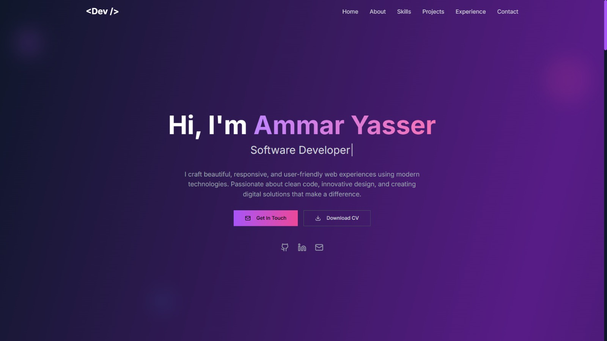

# 🌐 Personal Portfolio Website  

A modern, responsive portfolio website built with **Next.js** showcasing my projects, skills, and experience.


---

## ✨ Features  

- ⚡ **Next.js 14** with App Router  
- 📱 Fully responsive design (mobile-friendly)  
- 🎨 Styled with Tailwind CSS (or your CSS framework)  
- 📝 Dynamic content for projects and blogs  
- 🌙 Dark mode toggle  

---

## 🖼️ Screenshots  

| Home Page | Projects Page |
|-----------|---------------|
|  |  |


---

## 🛠️ Tech Stack  

- **Next.js** (v14)  
- **React**  
- **Tailwind CSS**  
- **Framer Motion** (for animations)  
- **Vercel** (deployment)

---

## 🚀 Getting Started  

Clone the repository:  

```bash
git clone https://github.com/yourusername/portfolio.git
cd portfolio
npm install
npm run dev
